# 团队简介

>Inveta团队是一支由建模、美术、场景地编、UE开发组成的年轻团队。团队致力于三维数字孪生技术分享与研发。团队核心成员如下：

| 核心成员   | 头像 | 个人简介                                                                                                                                                         |
| ---------- | ---- | ---------------------------------------------------------------------------------------------------------------------------------------------------------------- |
| g0415shenw | 👨🏻    | 10多年程序开发经验，熟练使用C++、C#、java、python、nodejs等多种语言和框架，擅长音视频相关开发以及各种三维模型数据格式的处理，另外对虚幻引擎的C++开发也比较擅长。 |
| wedo       | 👨🏻    | 10多年软件开发经验，熟练使用C++、QT、java、android等多种语言和框架，全栈技术开发，擅长程序架构设计，UE蓝图开发，UE动画特效设计，UE插件开发。                     |
| 斤恒玉     | 👨🏻    | 5年计算机图形学研发经验，精通JavaScript、Html/CSS、blueprint、Glsl/Hlsl等二三维图形语言，熟悉前端开发、WebGL、UE5美术、CG/TA技术栈、建模软件。                   |
| wolfs      | 👨🏻    | 10多年程序开发经验，熟练使用C#、netframework、WPF、java、vue、JavaScript等多种语言和框架，擅长程序架构设计，业务需求解析，后期技术支持等。                       |
| 6TING      | 👩🏻    | 5年UI设计经验，项目经验丰富，具备大屏数据可视化设计、B端网页设计、移动端设计等项目综合设计能力，熟悉多平台设计规范，准确理解需求基础上输出优质效果图。           |
| 松墙浦     | 👨🏻    | 多年三维模型工作经验，熟练使用3dsMax、Maya、UE5、SP等软件，熟悉多种行业规范和工作流程，擅长模型、贴图、UE5场景。是团队中的模型和地编。                           |
| FF         | 👨🏻    | 多年三维模型工作经验，熟练使用3dsMax、UE5、SP、Houdini、Revite等软件，擅长模型、UE材质贴图。                                                                     |
| 葉鲸岩     | 👩🏻    | 多年三维场景工作经验，熟练使用UE5、Unity、3Dmax、SP、Blender等软件，擅长模型制作与贴图制作。                                                                     |

```mermaid
pie  
    title 团队研究方向
    "Web前端" : 10
    "图形学" : 15
    "建模" : 17
    "UI美术" :  10
    "场景地编": 10
    "其他": 8
```

```mermaid
pie  
    title 团队技能分布
    "Javascript" : 9
    "Node.js" : 12
    "C/C++":   9
    "WebGL": 5
    "Unreal Engine" : 17
    "3Ds Max" : 16
    "Blender" :  9
    "Revit":5
    "Photo Shop": 14
    "其他": 30
```





# 欢迎加入技术交流qq群：681464378


```stl
solid Exported from Blender-3.4.0
facet normal 0.000000 0.000000 1.000000
outer loop
vertex 1.000000 0.000000 0.000000
vertex 0.500000 1.500000 0.000000
vertex 0.000000 0.000000 0.000000
endloop
endfacet
facet normal 0.000000 0.000000 1.000000
outer loop
vertex 1.000000 2.000000 0.000000
vertex 0.000000 2.000000 0.000000
vertex 0.500000 0.500000 0.000000
endloop
endfacet
facet normal 0.000000 0.000000 1.000000
outer loop
vertex 3.000000 1.300000 0.000000
vertex 2.000000 2.000000 0.000000
vertex 2.000000 0.000000 0.000000
endloop
endfacet
facet normal 0.000000 0.000000 1.000000
outer loop
vertex 2.500000 0.700000 0.000000
vertex 3.500000 0.000000 0.000000
vertex 3.500000 2.000000 0.000000
endloop
endfacet
facet normal 0.000000 0.000000 1.000000
outer loop
vertex 5.000000 1.000000 0.000000
vertex 5.000000 0.000000 0.000000
vertex 6.000000 2.000000 0.000000
endloop
endfacet
facet normal 0.000000 0.000000 1.000000
outer loop
vertex 5.000000 1.000000 0.000000
vertex 4.000000 2.000000 0.000000
vertex 5.000000 0.000000 0.000000
endloop
endfacet
facet normal 0.000000 0.000000 1.000000
outer loop
vertex 11.500000 1.000000 0.000000
vertex 12.500000 0.000000 0.000000
vertex 11.500000 2.000000 0.000000
endloop
endfacet
facet normal 0.000000 0.000000 1.000000
outer loop
vertex 11.500000 1.000000 0.000000
vertex 11.500000 2.000000 0.000000
vertex 10.500000 0.000000 0.000000
endloop
endfacet
facet normal 0.000000 0.000000 1.000000
outer loop
vertex 9.800000 0.000000 0.000000
vertex 9.500000 2.000000 0.000000
vertex 9.200000 0.000000 0.000000
endloop
endfacet
facet normal 0.000000 0.000000 1.000000
outer loop
vertex 10.500000 2.000000 0.000000
vertex 8.500000 2.000000 0.000000
vertex 9.500000 1.500000 0.000000
endloop
endfacet
facet normal 0.000000 0.000000 1.000000
outer loop
vertex 8.000000 2.000000 0.000000
vertex 6.500000 2.000000 0.000000
vertex 7.000000 1.000000 0.000000
endloop
endfacet
facet normal 0.000000 0.000000 1.000000
outer loop
vertex 8.000000 0.000000 0.000000
vertex 7.000000 1.000000 0.000000
vertex 6.500000 0.000000 0.000000
endloop
endfacet
endsolid Exported from Blender-3.4.0

```